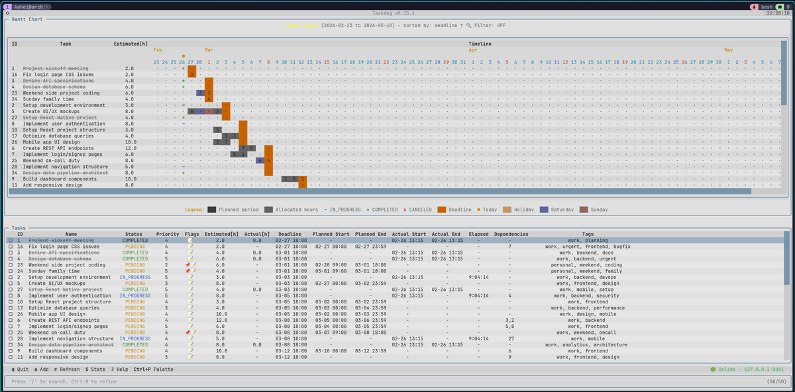
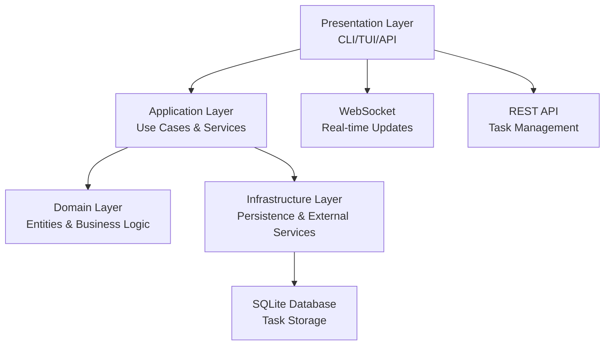

# Motion


[](https://pypi.org/project/motion-ui/)
[](https://opensource.org/licenses/MIT)
[](https://www.python.org/downloads/)

A task management system with CLI/TUI interfaces and REST API server, featuring time tracking, schedule optimization, and beautiful terminal output.

Designed for individual use. Stores tasks locally in SQLite database.

https://github.com/user-attachments/assets/47022478-078d-4ad9-ba7d-d1cd4016e105

**TUI (Textual)**



**Gantt Chart (CLI)**


## Architecture Overview

Motion follows Clean Architecture with clear separation of concerns:



## Try It Out

Try motion with ~50 sample tasks. No installation required — just Docker and Docker Compose:

```bash
# Clone the repo first
git clone https://github.com/capista-cookie/motion.git
cd motion

# Run the demo
docker-compose -f docker-compose.demo.yaml up --build -d

# Wait for the server and demo data to be ready (~15s)
docker-compose -f docker-compose.demo.yaml logs -f | grep -m1 "Server ready"

# Connect from your host for the best TUI experience
uvx --from motion-ui motion tui
```

> `uvx` comes with [uv](https://github.com/astral-sh/uv). It runs the command in a temporary environment without installing anything.
>
> If you prefer to run everything inside the container (TUI directly), use:
> ```bash
> docker-compose -f docker-compose.demo.yaml up --build
> ```
> Note: Some keybindings (e.g., `Ctrl+P` for command palette) may conflict with Docker's key sequences.

## Installation

**Requirements**: Python 3.12+, [uv](https://github.com/astral-sh/uv)

**Supported Platforms**: Linux, macOS

### Recommended (with systemd/launchd service)

```bash
git clone https://github.com/cookie-may/motion.git
cd motion
make install
```

This installs the CLI/TUI and server, and sets up a systemd (Linux) or launchd (macOS) service so the server starts automatically.

### From PyPI

```bash
pip install motion-ui[server]
```

You'll need to manage the server process yourself (e.g., `motion-server &`).

### Usage

```bash
motion add "My first task" --priority 10
motion table
motion gantt
motion tui
```

For complete setup including API key configuration, see **[Quick Start Guide](docs/QUICKSTART.md)**.

## Features

- **Multiple Interfaces**: CLI, full-screen TUI, and REST API
- **Schedule Optimization**: 9 algorithms (greedy, genetic, monte carlo, etc.)
- **Time Tracking**: Automatic tracking with planned vs actual comparison
- **Gantt Chart**: Visual timeline with workload analysis
- **Task Dependencies**: With circular dependency detection
- **Markdown Notes**: Editor integration with Rich rendering
- **Audit Logging**: Track all task operations
- **MCP Integration**: Claude Desktop support via Model Context Protocol

## Architecture

UV workspace monorepo with five packages:

| Package | Description | PyPI |
| ------- | ----------- | ---- |
| [motion-core](packages/motion-core) | Core business logic and SQLite persistence | [](https://pypi.org/project/motion-core/) |
| [motion-client](packages/motion-client) | HTTP API client library | [](https://pypi.org/project/motion-client/) |
| [motion-server](packages/motion-server) | FastAPI REST API server | [](https://pypi.org/project/motion-server/) |
| [motion-ui](packages/motion-ui) | CLI and TUI interfaces | [](https://pypi.org/project/motion-ui/) |
| [motion-mcp](packages/motion-mcp) | MCP server for Claude Desktop | [](https://pypi.org/project/motion-mcp/) |

## Documentation

- **[Quick Start Guide](docs/QUICKSTART.md)** - Step-by-step setup
- **[CLI Commands Reference](docs/COMMANDS.md)** - Complete command documentation
- **[API Reference](docs/API.md)** - REST API endpoints and examples
- **[Configuration Guide](docs/CONFIGURATION.md)** - All configuration options
- **[Design Philosophy](docs/DESIGN_PHILOSOPHY.md)** - Why Motion works this way
- **[Deployment Guide](contrib/README.md)** - Docker, systemd, launchd

## Contributing

Contributions are welcome! See [CONTRIBUTING.md](CONTRIBUTING.md) for guidelines.

## License

MIT License - see [LICENSE](LICENSE) for details.
